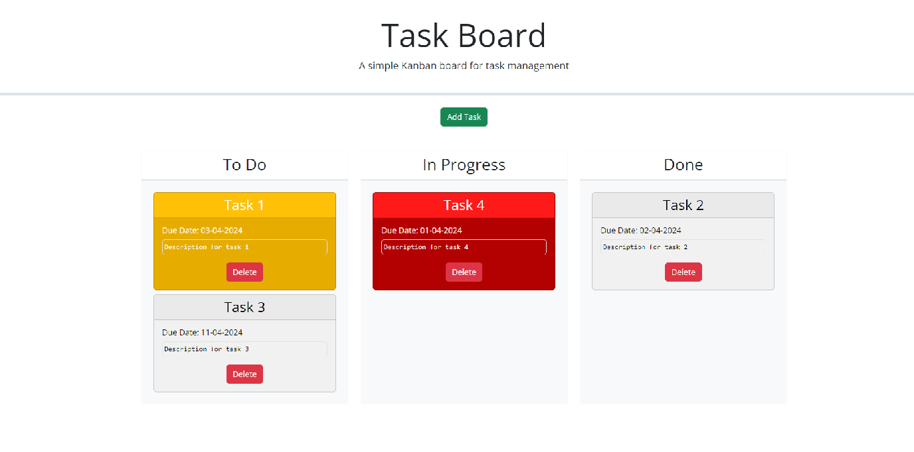
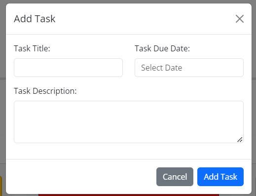

# Task Board

## Description

A Kanban board for task management.

## Usage

Visit [Task Board](https://ehsanh2001.github.io/task-board/) page.

On the page, you can see the tasks and their progress. The tasks are color-coded based on their deadlines:

-   Grey for deadlines in the future.
-   Yellow for tasks with a deadline of today.
-   Red for passed deadlines

The tasks that are completed are colored grey.

You can drag tasks to other columns.

### Adding a New Task

To add a new task, press the "Add Task" button and fill out the form. The newly added task will be placed in the "To Do" column.

## Credit

The "Add Task" dialog is created with the help of ChatGPT.
